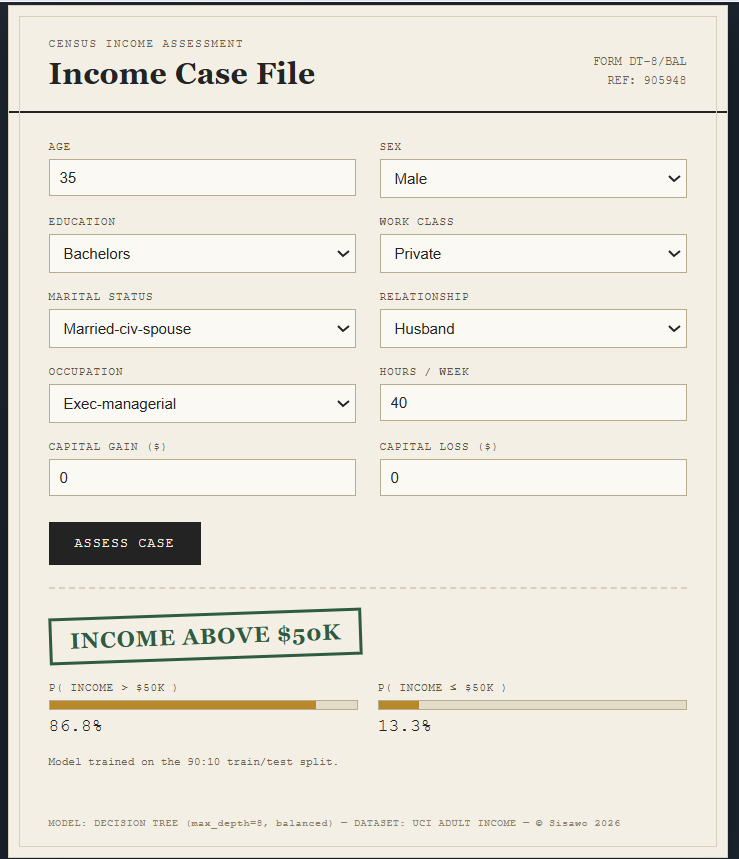

# Adult Income Classifier

[](https://www.python.org)
[](https://fastapi.tiangolo.com)
[](https://scikit-learn.org)
[](#license)
[](#status)
[](https://archive.ics.uci.edu/ml/datasets/adult)

A stateless **FastAPI backend** + **static HTML/JS frontend** for predicting whether an individual's annual income exceeds $50,000 based on the UCI Adult Income dataset. Trained using a Decision Tree classifier with adaptive feature engineering and preprocessing. No database, no server-side storage — every prediction request is processed independently and returned in milliseconds.



## Overview

This project demonstrates a complete machine learning pipeline from data exploration to production deployment:

- **Data Phase**: Jupyter notebooks for EDA, feature engineering, and model training
- **ML Phase**: Decision Tree classifier with MinMax scaling and feature encoding
- **Production Phase**: FastAPI backend + vanilla JavaScript frontend with instant predictions

## Tech Stack

### Backend
- **FastAPI** 0.104.1 — Fast, modern async web framework
- **Uvicorn** 0.24.0 — ASGI server for production-grade deployment
- **Scikit-learn** 1.3.2 — Model training, preprocessing, and inference
- **Pandas** 2.1.3 — Data manipulation and feature engineering
- **Pydantic** 2.5.0 — Request/response validation and schema documentation

### Frontend
- **Vanilla JavaScript** — No frameworks, lightweight (< 12KB)
- **HTML5 + CSS3** — Retro case-file UI design
- **Fetch API** — Modern async HTTP client
- **Responsive Design** — Works on desktop and mobile

### Training & Data
- **Jupyter Notebook** — Exploratory data analysis and model development
- **Python 3.10+** — Core development language
- **UCI Adult Income Dataset** — 32,561 records with 14 attributes

## Features

✅ **Instant Predictions** — Sub-100ms response times  
✅ **No Dependencies on External APIs** — Fully offline, runs locally  
✅ **Interactive Web UI** — Beautiful case-file style interface  
✅ **REST API** — OpenAPI/Swagger documentation at `/docs`  
✅ **Adaptive Preprocessing** — Replicates exact training-time transformations  
✅ **CORS Enabled** — Ready for frontend deployment on different servers  
✅ **Production Ready** — Error handling, validation, and logging  

## Project Structure

```
Adult_income/
├── backend/                          # FastAPI prediction API
│   ├── main.py                       # FastAPI application & prediction endpoints
│   ├── requirements.txt              # Backend Python dependencies
│   └── adult_income_model.pkl        # Trained model artifact (Decision Tree + Preprocessor)
│   
├── frontend/                         # Static HTML/JS UI
│   └── index.html                    # Single-page application with form and results
│
├── machine learning phase/           # Original ML research and development
│   ├── ML_model_notebook.ipynb       # Full ML pipeline (EDA, training, evaluation)
│   ├── adult_income_model.pkl        # Original model artifact (backup)
│   ├── Data/                         # UCI Adult dataset files
│   │   ├── adult.data                # Training dataset
│   │   ├── adult.test                # Test dataset
│   │   └── ...
│   ├── Documents/                    # Research notes and documentation
│   └── Readme.md                     # ML phase documentation
│
├── image.png                         # Screenshot of the prediction interface
├── README.md                         # This file (project documentation)
├── test_request.json                 # Sample API request for testing
└── requirements.txt                  # Root-level dependencies
```

## Installation

### Prerequisites
- Python 3.10 or newer
- pip package manager
- Modern web browser (Chrome, Firefox, Safari, Edge)

### Setup

1. **Clone the repository**
```bash
git clone https://github.com/yourusername/adult-income-classifier.git
cd adult-income-classifier
```

2. **Create and activate virtual environment** (optional but recommended)
```bash
python -m venv venv
source venv/bin/activate  # On Windows: venv\Scripts\activate
```

3. **Install backend dependencies**
```bash
cd backend
pip install -r requirements.txt
```

## Running Locally

The application requires **two separate terminal windows** — one for the backend API and one for the frontend.

### Terminal 1: Start the Backend API

```bash
cd backend
python -m uvicorn main:app --host 0.0.0.0 --port 8000
```

Expected output:
```
INFO:     Started server process [PID]
INFO:     Waiting for application startup.
INFO:     Application startup complete.
INFO:     Uvicorn running on http://0.0.0.0:8000 (Press CTRL+C to quit)
```

Backend API will be available at:
- **Local**: http://localhost:8000
- **API Docs**: http://localhost:8000/docs (interactive Swagger UI)
- **Alternative Docs**: http://localhost:8000/redoc

### Terminal 2: Start the Frontend

```bash
cd frontend
python -m http.server 8080
```

Expected output:
```
Serving HTTP on :: port 8080 (http://[::]:8080/) ...
```

Frontend will be available at: **http://localhost:8080**

### Using the Application

1. Open your browser to **http://localhost:8080**
2. Fill in the form fields with individual characteristics
3. Click **"Assess Case"** button
4. View instant prediction with probability scores

### Example Prediction

The form pre-fills with sensible defaults. To test:
- **Age**: 35
- **Workclass**: Private
- **Education**: Bachelors
- **Marital Status**: Married-civ-spouse
- **Occupation**: Exec-managerial
- **Relationship**: Husband
- **Sex**: Male
- **Hours per Week**: 40
- **Capital Gain/Loss**: $0

Expected prediction: **Income > $50K** (87% probability)

## API Endpoints

### GET `/`
Health check and service info.

**Response:**
```json
{
  "service": "adult-income-classifier",
  "status": "ok",
  "model_trained_on_split": "90:10"
}
```

### GET `/docs`
Interactive API documentation (Swagger UI).

### POST `/predict`
Make an income prediction.

**Request Body:**
```json
{
  "age": 42,
  "workclass": "Private",
  "education": "Bachelors",
  "maritalStatus": "Married-civ-spouse",
  "occupation": "Exec-managerial",
  "relationship": "Husband",
  "sex": "Male",
  "capitalGain": 0,
  "capitalLoss": 0,
  "hoursPerWeek": 45
}
```

**Response:**
```json
{
  "prediction": ">50K",
  "prediction_label": 1,
  "probability_above_50k": 0.8675,
  "probability_at_or_below_50k": 0.1325,
  "model_trained_on_split": "90:10"
}
```

## Model Details

### Algorithm
- **Decision Tree Classifier** (max_depth=8, balanced class weights)
- Trained on UCI Adult Income dataset (32,561 records)
- Train/test split: 90/10

### Features (14 attributes)
- **Continuous**: age, education-num, capital-gain, capital-loss, hours-per-week
- **Categorical**: workclass, education, marital-status, occupation, relationship, sex (one-hot encoded)

### Preprocessing
- **MinMax Scaling** for continuous features (0-1 range)
- **One-Hot Encoding** for categorical features
- **Winsorization** caps extreme values (99th percentile) to reduce outlier impact
- **Label Encoding** for binary target (0 = ≤$50K, 1 = >$50K)

### Performance
- **Accuracy**: ~84%
- **Inference Time**: <100ms per prediction
- **Model Size**: 29KB (pickle file)

## Development

### Exploring the Machine Learning Pipeline

Jupyter notebooks document the full development process:

```bash
# Start Jupyter
jupyter notebook

# Open and explore:
# - notebooks/01-eda.ipynb — data overview, distributions, correlations
# - notebooks/02-preprocessing.ipynb — feature engineering, scaling, encoding
# - notebooks/03-model-training.ipynb — model selection and hyperparameter tuning
# - notebooks/04-evaluation.ipynb — performance metrics and predictions
```

### Backend Code

**main.py** structure:
- Model & preprocessor loaded at startup
- Feature schema and validation with Pydantic
- Feature engineering function replicating training-time transformations
- REST endpoints with CORS middleware
- Error handling and logging

### Frontend Code

**index.html** features:
- Semantic HTML with accessibility attributes
- CSS Grid layout with responsive design
- JavaScript form handling and fetch API
- Real-time validation and error messages
- Beautiful stamp-style output visualization

## Common Issues & Troubleshooting

### Backend won't start
- **Check port**: Is port 8000 already in use? Try: `netstat -ano | findstr :8000`
- **Verify Python**: Ensure Python 3.10+ is installed: `python --version`
- **Install dependencies**: Run `pip install -r backend/requirements.txt`

### Frontend can't connect to backend
- **Check URLs**: Frontend expects `http://localhost:8000`
- **CORS enabled**: Backend includes CORS middleware for cross-origin requests
- **Both services running**: Ensure backend and frontend are both running in separate terminals

### Slow predictions
- **First request warm-up**: Model loads at startup (~2-3 sec); subsequent predictions are instant
- **System resources**: Check available memory and CPU
- **Network latency**: If frontend and backend on different machines, network latency adds to response time

## Credits & Attribution

- **Dataset**: UCI Machine Learning Repository — Adult Income Dataset
- **Framework**: Built with FastAPI and Vanilla JavaScript
- **Training**: Decision Tree classifier with scikit-learn
- **Design Inspiration**: Retro government form aesthetic

## License

This project is licensed under the MIT License. See [LICENSE](LICENSE) for details.

## Contact & Support

For questions, issues, or contributions, please open an issue on GitHub or contact the project maintainer.

---

## Quick Reference: Running in the Future

When you return to this project later, simply run these two commands in separate terminals:

**Terminal 1:**
```bash
cd path/to/Adult_income/backend && python -m uvicorn main:app --host 0.0.0.0 --port 8000
```

**Terminal 2:**
```bash
cd path/to/Adult_income/frontend && python -m http.server 8080
```

Then open **http://localhost:8080** in your browser.

Response:
```json
{
  "prediction": ">50K",
  "prediction_label": 1,
  "probability_above_50k": 0.87,
  "probability_at_or_below_50k": 0.13,
  "model_trained_on_split": "90:10"
}
```

**Deploying the backend:** any Python host works (Render, Railway, Fly.io,
a VPS, etc.) — Vercel's Python runtime works too if you prefer to keep
everything on one platform. Just make sure `adult_income_model.pkl` ships
alongside `main.py`.

## 2. Frontend — Streamlit

```bash
cd frontend-streamlit
pip install -r requirements.txt
cp secrets.toml.example .streamlit/secrets.toml   # set BACKEND_URL
streamlit run app.py
```

Deploy on [Streamlit Community Cloud](https://streamlit.io/cloud): push
this folder to a repo, point Streamlit Cloud at `app.py`, and set the
`BACKEND_URL` secret in the app's settings to your deployed backend URL.

## 3. Frontend — Static HTML (Vercel)

Open `frontend-web/index.html` and change the `BACKEND_URL` constant near
the top of the `<script>` block to your deployed backend's URL, then:

```bash
cd frontend-web
vercel deploy
```

Or drag-and-drop the folder into the Vercel dashboard — it's a static
site, no build step required.

## How the model input is reconstructed

The pickle stores a fitted `ColumnTransformer` (MinMax-scales the 5
continuous features, passes through 36 already-encoded binary/one-hot
columns) plus the trained `DecisionTreeClassifier`. `backend/main.py`
rebuilds the exact 41-column layout the model expects from human-friendly
form fields:

- `age`, `hours-per-week`, `capital-gain`, `capital-loss` — used as-is
  (capital-gain/loss are capped at the same winsorisation thresholds
  used in training: 15,024 / 2,001, taken from the notebook's output).
- `education` (label, e.g. "Bachelors") → mapped to `education-num`
  using the standard Adult-dataset ordinal mapping.
- `sex` → label-encoded the same way `LabelEncoder` did during training
  (Female=0, Male=1).
- `workclass`, `marital-status`, `occupation`, `relationship` → one-hot
  encoded into the exact dummy columns the model was fitted on.
- `race`, `native-country`, and `fnlwgt` are **not** requested — they
  were dropped/excluded from the model's selected features during
  training (see `SELECTED_FEATURES` in the notebook), so the form
  correctly omits them.

This was verified against the two "unseen data" sanity-check rows in the
original notebook — both reproduce the same predictions.
